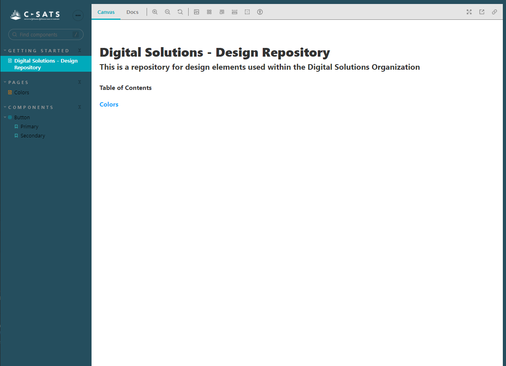
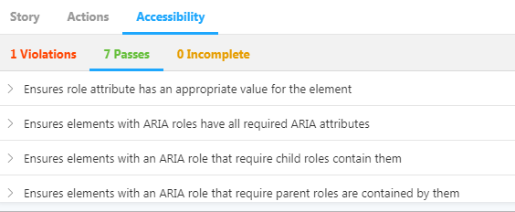
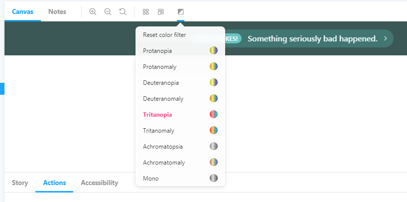
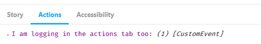
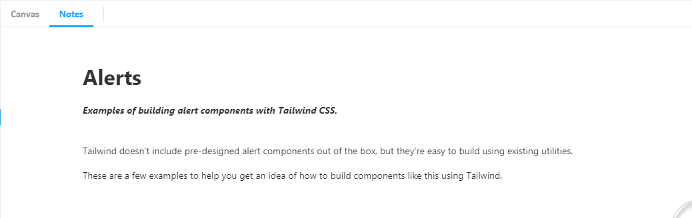
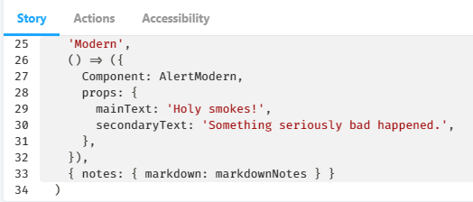
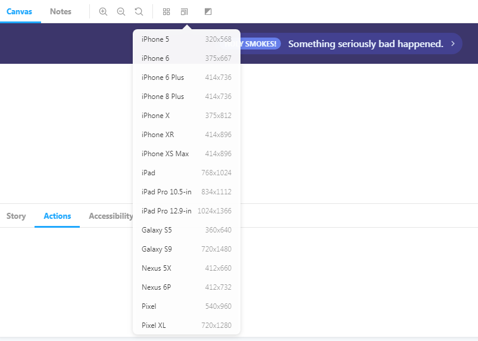

# Digital Solutions Design Repository

This repository contains the component library for Digital Solutions. Here you will find all the necessary color schemas and design components for our applications. This repository comprises of Storybook, Svelte and TailwindCSS.

This is a work-in-progress repository.

---

### Steps to build

```bash
// Quickstart
npm install
npm run storybook
```

You can open the Storybook UI at http://localhost:6006

#### Further Build Steps

1. Clone this repo `git clone https://github.com/slee204/digital-solutions-design-repository.git`
2. Go to the directory `cd digital-solutions-design-repository`
3. Install dependencies `npm install`
4. To develop your Svelte App: `npm run dev`
5. To develop UI components independent of your app: `npm run stories`
6. Open storybook UI: `npm run storybook`

---

### Storybook UI



The storybook UI will contain components (stories) or color combinations and components that C-SATS currently uses. This code will be frequently updated to make sure we are aligned between design and engineering teams.

---

## Documentation

1. Svelte - [API](https://svelte.dev/docs) and [Tutorial](https://svelte.dev/tutorial/)
2. TailwindCSS - [Docs](https://tailwindcss.com/docs) and [Tutorial](https://tailwindcss.com/screencasts/)
3. Storybook - [Docs](https://storybook.js.org/docs/basics/introduction/) and [Tutorial](https://www.learnstorybook.com/intro-to-storybook/svelte/en/get-started/)

### Storybook Addons

- Accessibility Addon



- Accessibility Addon - Colorblindness Emulation



- Actions Addon



- Notes Addon



- Source Addon



- Viewport Addon


